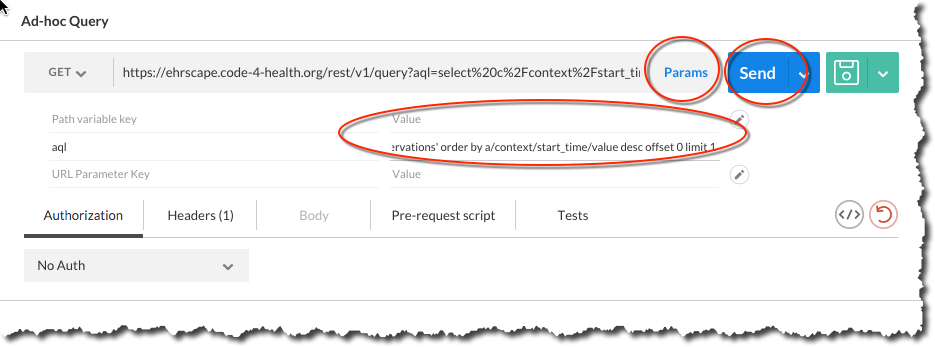
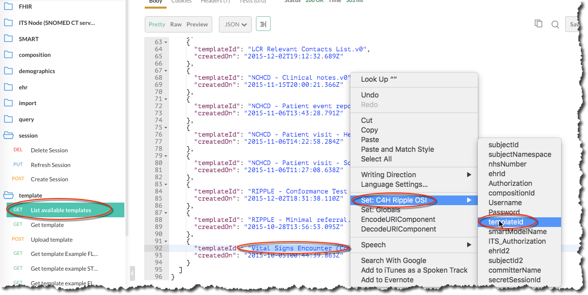
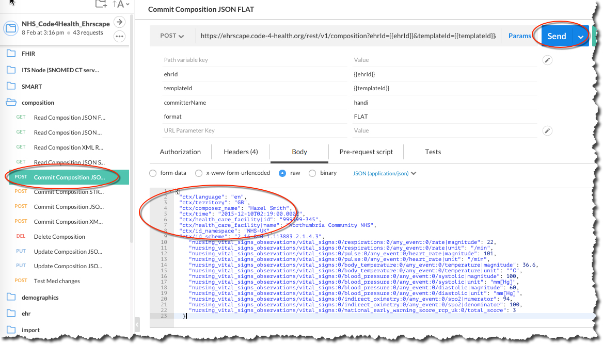
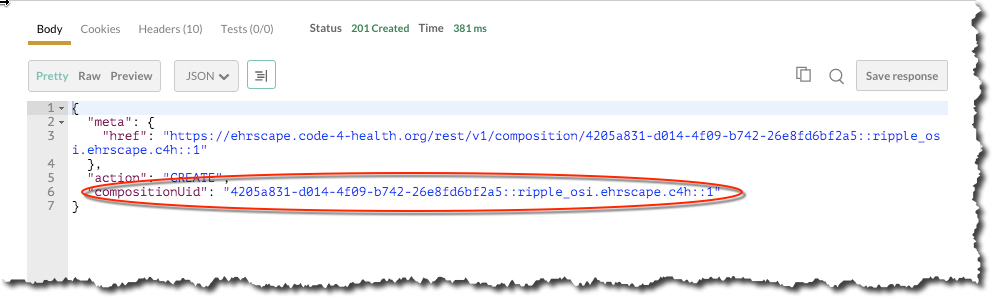

# Getting ready
This section describes a number of steps to get ready for working with Ehrscape.

## Get Postman

First you need to install a copy of the API runner application `Postman` (Chrome/Macos/Windows) [Postman Application](http://getpostman.com)
This lets you send and receive data from the Ehrscape API without the need for a specific programming language.

Postman also allows you to import a preset collection of API calls which we can use to supply a copy of the Ehrscape API and associated 'environment' file, which contains settings for a specific ehrscape domain (either )

## A. Import Postman 'openEHR_Ehrscape' collection

If you have already installed the Postman app, clicking this [Collection link](https://www.getpostman.com/collections/aa0eeb03ab2d1324b774) should import the 'openEHR_Ehrscape' collection.

## B. Run Postman

Click the 'Run Postman Button' to import the Postman 'openEHR_Ehrscape' API collection and associated `Operon Sandpit` environment settings.

[](https://app.getpostman.com/run-collection/aa0eeb03ab2d1324b774#?env%5Boprn_sandpit%5D=W3sia2V5Ijoib3BlbkVockFwaSIsInR5cGUiOiJ0ZXh0IiwidmFsdWUiOiJodHRwczovL3Rlc3Qub3Blcm9uLnN5c3RlbXMiLCJlbmFibGVkIjp0cnVlfSx7ImtleSI6ImRvbWFpbk5hbWUiLCJ0eXBlIjoidGV4dCIsInZhbHVlIjoic2FuZHBpdCIsImVuYWJsZWQiOnRydWV9LHsia2V5IjoiZG9tYWluU3VmZml4IiwidHlwZSI6InRleHQiLCJ2YWx1ZSI6Im9wcm4xIiwiZW5hYmxlZCI6dHJ1ZX0seyJrZXkiOiJDRFJOYW1lIiwidHlwZSI6InRleHQiLCJ2YWx1ZSI6ImVocnNjYXBlLmNvbSIsImVuYWJsZWQiOnRydWV9LHsia2V5IjoiU2Vzc2lvbkhlYWRlciIsInR5cGUiOiJ0ZXh0IiwidmFsdWUiOiJFaHItU2Vzc2lvbi1kaXNhYmxlZCIsImVuYWJsZWQiOnRydWV9LHsia2V5Ijoie3tTZXNzaW9uSGVhZGVyfX0iLCJ0eXBlIjoidGV4dCIsInZhbHVlIjoiIiwiZW5hYmxlZCI6dHJ1ZX0seyJrZXkiOiJQYXNzd29yZCIsInR5cGUiOiJ0ZXh0IiwidmFsdWUiOiJWeW9CQTYsODlncCIsImVuYWJsZWQiOnRydWV9LHsia2V5IjoiVXNlcm5hbWUiLCJ0eXBlIjoidGV4dCIsInZhbHVlIjoib3BybjFfc2FuZHBpdCIsImVuYWJsZWQiOnRydWV9LHsia2V5IjoiYWNjb3VudE5hbWUiLCJ0eXBlIjoidGV4dCIsInZhbHVlIjoib3BybjFfc2FuZHBpdCIsImVuYWJsZWQiOnRydWV9LHsia2V5IjoiZG9tYWluU3lzdGVtSWQiLCJ0eXBlIjoidGV4dCIsInZhbHVlIjoic2FuZHBpdC5vcHJuMS5laHJzY2FwZS5jb20iLCJlbmFibGVkIjp0cnVlfSx7ImtleSI6IkF1dGhvcml6YXRpb24iLCJ0eXBlIjoidGV4dCIsInZhbHVlIjoiQmFzaWMgYjNCeWJqRmZjMkZ1WkhCcGREcFdlVzlDUVRZc09EbG5jQT09IiwiZW5hYmxlZCI6dHJ1ZX0seyJrZXkiOiJjb21taXR0ZXJOYW1lIiwidHlwZSI6InRleHQiLCJ2YWx1ZSI6IkRyIHNhbmRwaXQiLCJlbmFibGVkIjp0cnVlfSx7ImtleSI6InBhdGllbnROYW1lIiwidHlwZSI6InRleHQiLCJ2YWx1ZSI6Ikl2b3IgQ294IiwiZW5hYmxlZCI6dHJ1ZX0seyJrZXkiOiJzdWJqZWN0SWQiLCJ0eXBlIjoidGV4dCIsInZhbHVlIjoiOTk5OTk5OTAwMCIsImVuYWJsZWQiOnRydWV9LHsia2V5IjoibmhzTnVtYmVyIiwidHlwZSI6InRleHQiLCJ2YWx1ZSI6Ijk5OTk5OTkwMDAiLCJlbmFibGVkIjp0cnVlfSx7ImtleSI6InN1YmplY3ROYW1lc3BhY2UiLCJ0eXBlIjoidGV4dCIsInZhbHVlIjoidWsubmhzLm5oc19udW1iZXIiLCJlbmFibGVkIjp0cnVlfSx7ImtleSI6ImVocklkIiwidHlwZSI6InRleHQiLCJ2YWx1ZSI6IjM3NmU1YzRiLWYyYjEtNGQxZi04ZGUwLTNhNTkzZWVhNjE1YyIsImVuYWJsZWQiOnRydWV9LHsia2V5IjoicGFydHlJZCIsInR5cGUiOiJ0ZXh0IiwidmFsdWUiOiIxMDA2IiwiZW5hYmxlZCI6dHJ1ZX0seyJrZXkiOiJ0ZW1wbGF0ZUlkIiwidHlwZSI6InRleHQiLCJ2YWx1ZSI6IlZpdGFsIFNpZ25zIEVuY291bnRlciAoQ29tcG9zaXRpb24pIiwiZW5hYmxlZCI6dHJ1ZX0seyJrZXkiOiJjb21wb3NpdGlvbklkIiwidHlwZSI6InRleHQiLCJ2YWx1ZSI6IjU2ZWFlMDhiLTQ2OGEtNGRjNi1iOGJlLTcxMzE1Yjg3NjNmZDo6c2FuZHBpdC5vcHJuMS5laHJzY2FwZS5jb206OjIiLCJlbmFibGVkIjp0cnVlfSx7ImtleSI6IkVoci1TZXNzaW9uLWRpc2FibGVkIiwidHlwZSI6InRleHQiLCJ2YWx1ZSI6ImExMmJlMWJiLTRjMTEtNDBlYy04MzZhLTZkODIyODllMGJiOCIsImVuYWJsZWQiOnRydWV9LHsia2V5IjoiRWhyLVNlc3Npb24iLCJ0eXBlIjoidGV4dCIsInZhbHVlIjoiMTYxYzU4NWEtNGU1OS00YjY0LTg4N2UtNjRjMGIwZDY5ZmJkIiwiZW5hYmxlZCI6dHJ1ZX1d)

This will automatically install the Ehrscape Collection and Operon Sandpit environment files.

## or C. Download Postman files from Git

Click on these links to download the files to your system:

[openEHR Ehrscape Collection](openEHR_Ehrscape.postman_collection.json)

[Ripple Think!Ehr Environment]()

[Ripple EtherCis Environment](EtherCis%20Cloud.postman_environment.json)

## or D. Download your collection files from email
If you have received an email containing the collection and environment files to use with Postman. The first step is to download these files ready to then be imported into Postman.

Find `openEHR_Ehrscape.postman_collection.json` in your email and download it to a folder of your choice (normally the Download folder).

Find `<your_environment_name.postman_environment.json` in your email and download it to a folder of your choice (normally the Download folder). Please note that for demonstration purposes we are using the `Operon Sandpit` environment in this document.


### Import Downloaded files into Postman
If you have downloaded files from Github or from your email, these now need to be installed in Postman.

Open Postman and select `Import`


Locate your two save files and import them. You can either use the `Choose Files` option to import one at a time or drag and drop the files into the window


In the top right hand corner, change the environment to your environment (in the screenshot below that's the C4H Ripple OSI environment)


On the left hand side you can now see the collection files


## Navigate Postman
Click on the `openEHR Ehrscape Clinical Data Repository` to reveal the folders, and then click on individual folders to expand and reveal the contents


Selecting one of the API calls displays more detail on the right hand side


Clicking on the ``x`` icon in the top right hand corner reveals a number of pre-set variables for your selected environment (again the C4H Ripple environment is used just as an example). These pre-sets are used in some of the API calls as defaults.


# Working with Ehrscape
We are now ready to start working properly with Ehrscape.

## Create Session
The first step is to create an openEHR session and retrieve the `sessionId` token. This allows subsequent API calls to be made without needing to login on each occasion.

Navigate to the `session` folder and highlight `Create Session` on the left, then click on the `Send` button. The required credentials are automatically filled in from the Pre-sets file (see `Navigating Postman` section above)


Click the `Scroll to responses` button in the bottom right hand corner to display the response details.

The screenshot below shows the session Id which has been returned in the call.


## Get Patient EHR Identifier
The next step is to get the patient’s internal EHR identifier by sending their external identifier (in this case NHS Number). The ehrId is a unique string which, for security reasons, cannot be associated with the patient, if for instance their openEHR records were leaked.

Select `Get ehrStatus from subjectId` in the `ehr` folder and then click on the `Send` button. Again, the patient’s NHS number is taken from the Pre-sets file and is therefore filled in automatically.


Click on the `Scroll to responses` button in the bottom right hand corner to display the response details.

The JSON snippet below shows the ehrId for our dummy patient.


To store the returned ehrId as a pre-set for the selected environment, highlight the string in the response details, right mouse click, set the environment (*C4H Ripple OSI in this example*) and then select `ehrId` from the list of attributes.


## Retrieve a composition Id
Now that we have the patient’s EHR identifier, we can use it to locate and retrieve some clinical details. We use an Archetype Query Language (AQL) call to retrieve a list of the identifiers and dates of existing Nursing Vital Signs Observations Composition records. Compositions are document-level records which act as the container for all openEHR patient data.

The name/value of the Composition is the root name of the templates composition archetype (case-sensitive). In a real-world example we would query on other factors to ensure we had the ‘correct’ list.

The query we need to run in order to get the composition Id for the most recent vital signs composition for the selected patient is as follows:


At this stage you don’t need to worry about the exact syntax and how to create an AQL query. These topics are covered elsewhere, and the Specifications provide the required details.

Open the `query` folder and select `Ad-hoc query`


This is the query string in a format which can be copied and pasted:
```
select
a/uid/value as compositionId,
a/context/start_time/value as start_time
from EHR e[ehr_id/value='{{ehrId}}']
contains COMPOSITION a[openEHR-EHR-COMPOSITION.encounter.v1]
where a/name/value= 'Nursing Vital Signs Observations'
order by a/context/start_time/value desc
offset 0 limit 1
```

In the Ad-hoc Query window click on `Param` and paste the query string above into the `Value` field, then click on the `Send` button.



Click the `Scroll to response` button in the buttom right hand corner to display the response details. The `compositionId` element in the response is the unqique identifier for the composition and the `start_time` is the time that the document was authored.


We will use the results of this query to retrieve the full composition, so the final action is to store the composition Id as a pre-set.

Highlight the string in the response details, right mouse click, set the environment (`C4H Ripple OSI` in this example) and then select `compositionId` from the list of attributes


## Retrieve full composition based on compositionId
The next step is to retrieve the composition itself, based on the compositionId we stored in the previous step.

Navigate to the `composition` folder and highlight `Read Composition JSON FLAT`, then click the `Send` button


The result is shown as a FLAT JSON file below


Other formats are JSON RAW, XML RAW or JSON STRUCTURED – the snippets below show part of the Pulse data


## Persist composition
The next step is to persist a new composition. The data in the composition is validated against a template, and the first action is to set the correct template Id for composition to be persisted.

Navigate to the `Template` folder and highlight `List available templates`, then click the `Send` button. Highlight the `Vital Signs Encounter template` in the list of available templates, right mouse click, set the environment (`C4H Ripple OSI` in this example) and then select `templateId` from the list of attributes



Once the template Id is set, we can commit a composition. The following string is an example of a vital signs composition:
```
{
 "ctx/language": "en",
 "ctx/territory": "GB",
 "ctx/composer_name": "Hazel Smith",
 "ctx/time": "2015-12-10T02:19:00.000Z",
 "ctx/health_care_facility|id": "999999-345",
 "ctx/health_care_facility|name": "Northumbria Community NHS",
 "ctx/id_namespace": "NHS-UK",
 "ctx/id_scheme": "2.16.840.1.113883.2.1.4.3",
    "nursing_vital_signs_observations/vital_signs:0/respirations:0/any_event:0/rate|magnitude": 22,
    "nursing_vital_signs_observations/vital_signs:0/respirations:0/any_event:0/rate|unit": "/min",
    "nursing_vital_signs_observations/vital_signs:0/pulse:0/any_event:0/heart_rate|magnitude": 101,
    "nursing_vital_signs_observations/vital_signs:0/pulse:0/any_event:0/heart_rate|unit": "/min",
    "nursing_vital_signs_observations/vital_signs:0/body_temperature:0/any_event:0/temperature|magnitude": 36.6,
    "nursing_vital_signs_observations/vital_signs:0/body_temperature:0/any_event:0/temperature|unit": "°C",
    "nursing_vital_signs_observations/vital_signs:0/blood_pressure:0/any_event:0/systolic|magnitude": 100,
    "nursing_vital_signs_observations/vital_signs:0/blood_pressure:0/any_event:0/systolic|unit": "mm[Hg]",
    "nursing_vital_signs_observations/vital_signs:0/blood_pressure:0/any_event:0/diastolic|magnitude": 60,
    "nursing_vital_signs_observations/vital_signs:0/blood_pressure:0/any_event:0/diastolic|unit": "mm[Hg]",
    "nursing_vital_signs_observations/vital_signs:0/indirect_oximetry:0/any_event:0/spo2|numerator": 94,
    "nursing_vital_signs_observations/vital_signs:0/indirect_oximetry:0/any_event:0/spo2|denominator": 100,
    "nursing_vital_signs_observations/vital_signs:0/national_early_warning_score_rcp_uk:0/total_score": 3
  }
  ```
As mentioned before, the exact syntax and how to create a composition will be covered elsewhere. At this stage you should just use the syntax string provided above.

Navigate to the `Composition` folder and highlight `Commit Composition JSON FLAT`. Paste the text above into the Body text box on the right hand side and click on the `Send` button.



The result shows the composition Id for the newly committed composition.



## Run AQL query
The next step is to run a query on recent vital signs compositions and return a set of key data.

Navigate to the `query` folder and select `Ad-hoc Query`.

This is the query string we are going to use to retrieve the last 5 vital signs compositions and return the relevant readings. Once again, just to clarify: the exact syntax and how to create an AQL query will be covered elsewhere. At this stage you can just copy and paste the query syntax string shown below:
```
select
a/uid/value as compositionId,
a/context/start_time/value as start_time,
b_a/data[at0001]/events[at0002]/data[at0003]/items[at0004]/value/magnitude as Rate_magnitude,
b_b/data[at0002]/events[at0003]/data[at0001]/items[at0004]/value/magnitude as Heart_Rate_magnitude,
b_c/data[at0002]/events[at0003]/data[at0001]/items[at0004]/value/magnitude as Temperature_magnitude,
b_f/data[at0001]/events[at0006]/data[at0003]/items[at0004]/value/magnitude as Systolic_magnitude,
b_f/data[at0001]/events[at0006]/data[at0003]/items[at0005]/value/magnitude as Diastolic_magnitude,
b_g/data[at0001]/events[at0002]/data[at0003]/items[at0006]/value/numerator as spO2_numerator,
b_h/data[at0001]/events[at0002]/data[at0003]/items[at0028]/value/magnitude as Total_Score_magnitude
from EHR e[ehr_id/value='{{ehrId}}']
contains COMPOSITION a[openEHR-EHR-COMPOSITION.encounter.v1]
contains (OBSERVATION b_a[openEHR-EHR-OBSERVATION.respiration.v1]
or OBSERVATION b_b[openEHR-EHR-OBSERVATION.pulse.v1]
or OBSERVATION b_c[openEHR-EHR-OBSERVATION.body_temperature.v1]
or OBSERVATION b_f[openEHR-EHR-OBSERVATION.blood_pressure.v1]
or OBSERVATION b_g[openEHR-EHR-OBSERVATION.indirect_oximetry.v1]
or OBSERVATION b_h[openEHR-EHR-OBSERVATION.news_rcp_uk.v1])
where a/name/value= 'Nursing Vital Signs Observations'
order by a/context/start_time/value desc
offset 0 limit 5
```

In the Ad-hoc query window click on `Params` and enter the query string into the `Value` field on the right hand side, then click the `Send` button.


The result set contains the last 5 vital signs compositions and the data points within the compositions


## Close session
The final step is to close the openEHR session.

To do this, navigate to the `session` folder and select `Delete Session`. Click on the `Send` button.

The result will show a null sessionId, indicating that there is no open session.


